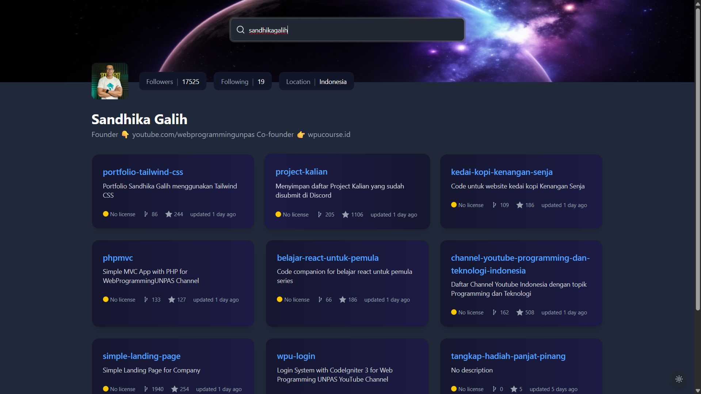

<!-- Please update value in the {}  -->

<h1 align="center">Github Profile | devChallenges</h1>

   Solution for a challenge <a href="https://devchallenges.io/challenge/github-profile" target="_blank">GitHub Profile</a> from <a href="http://devchallenges.io" target="_blank">devChallenges.io</a>.

  <h3>
    <a href="https://github-profile-alpha-two.vercel.app/">
      Demo
    </a>
     | 
    <a href="https://github.com/pius706975/devchallenges-github-profile">
      Solution
    </a>
     | 
    <a href="https://devchallenges.io/challenge/github-profile">
      Challenge
    </a>
  </h3>

<!-- TABLE OF CONTENTS -->

## Table of Contents

- [Overview](#overview)
- [Built with](#built-with)
- [Features](#features)
- [Contact](#contact)
- [Acknowledgements](#acknowledgements)

<!-- OVERVIEW -->

## Overview

### Built with
- [Vue.js](https://vuejs.org/)
- [Tailwind](https://tailwindcss.com/)
- [Shadcn Vue](https://www.shadcn-vue.com)

## 

This application/site was created as a submission to a [DevChallenges](https://devchallenges.io/challenges-dashboard) challenge.

## Author

- Website [https://piusrestiantoro.vercel.app/](https://piusrestiantoro.vercel.app/)
- GitHub [@pius706975](https://github.com/pius706975)
